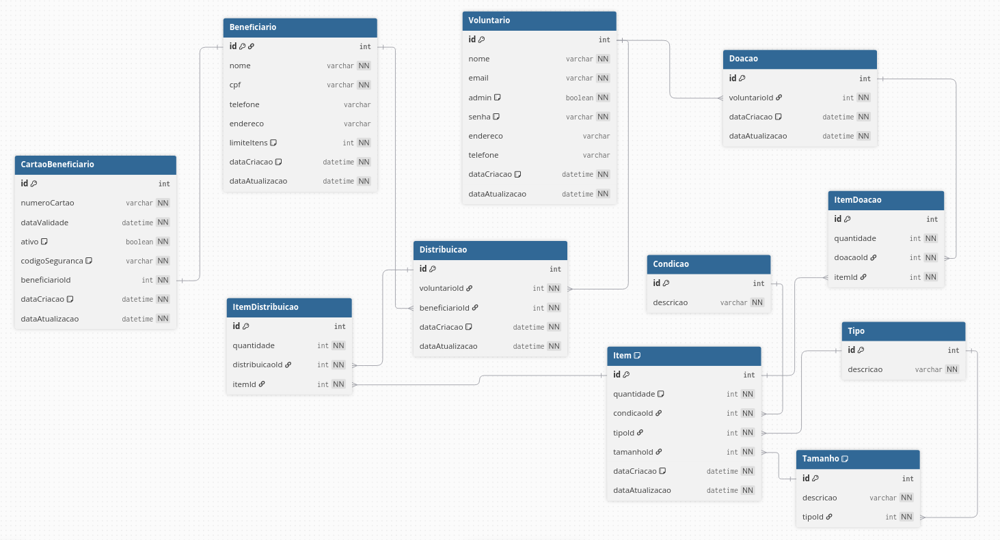

## Oficina Quarteto Fantastico

Um sistema de gerenciamento de estoque feito com Express e React.

---

## 📋 Índice

- [📦 Sobre o Projeto](#-sobre-o-projeto)
- [🚀 Tecnologias](#-tecnologias)
- [⚙️ Instalação](#️-instalação)
- [🧪 Como Usar](#-como-usar)
- [📄 Documentação](#-documentação-)
- [🛠 Funcionalidades](#-funcionalidades)
- [🧑‍💻 Contribuindo](#-contribuindo)
- [📄 Licença](#-licença)

---

## 📦 Sobre o Projeto

O nosso projeto tem como objetivo desenvolver um aplicativo para a SANEM, cumprindo as necessidades dos usuários e fazendo o controle de doações.

---

## 🚀 Tecnologias

**Frontend**

- React + Vite
- CSS Modules

**Backend**

- Node.js + Express (TypeScript)
- Prisma ORM (PostgreSQL) com driver adapter `@prisma/adapter-pg`
- Autenticação JWT (`jsonwebtoken`)
- Validação com Zod
- Documentação OpenAPI/Swagger (`swagger-jsdoc` + `swagger-ui-express`)

**Infra**

- Docker e Docker Compose
- Scripts de migração/seed via Prisma

---

## ⚙️ Instalação

### Backend

1. Instale as dependências:
   ```bash
   npm install
   ```
2. Configure `.env` com `DATABASE_URL`, `JWT_SECRET`, credenciais de seed (`SEED_ADMIN_EMAIL`, `SEED_ADMIN_PASSWORD`) e outras variáveis necessárias.
3. Suba com Docker:
   ```bash
   docker compose up --build
   ```
4. (Opcional) Rodar migrações manualmente:
   ```bash
   docker compose exec app npx prisma migrate deploy
   ```
5. (Opcional) Rodar seed:
   ```bash
   docker compose exec app npx tsx prisma/seed.ts
   ```

### Frontend

1. Vá para `frontend/`:
   ```bash
   cd frontend
   ```
2. Instale dependências:
   ```bash
   npm install
   ```
3. Crie/ajuste `.env` do frontend se necessário (ex.: `VITE_API_URL`).
4. Rode localmente:
   ```bash
   npm run dev
   ```

---

## 🧪 Como usar

### Backend

1. Acesse `http://localhost:3000`.
2. Documentação da API: `http://localhost:3000/apidocs` (UI) ou `http://localhost:3000/apidocs.yaml` (YAML).

### Frontend

1. Com o backend rodando, acesse o Vite dev server (ex.: `http://localhost:5173`).
2. Use as credenciais seed (definidas no `.env` do backend) para login inicial.

---

## 📄 Documentação

- Swagger UI: `http://localhost:3000/apidocs`
- OpenAPI YAML: `http://localhost:3000/apidocs.yaml`
- Documento de visão: [Google Docs](https://docs.google.com/document/d/1Wcm7rU8M-KzOWyroloNW2MCT5hMKPz27V5oUWZ41BAA/edit?tab=t.0#heading=h.t5lws1x1u33z)
- Board (GitHub Projects): https://github.com/users/TheBud4/projects/4/views/3

### MER (diagrama ER)

- Caminho: `backend/docs/MER.png`
- Pré-visualização:

  

---

## 🛠 Funcionalidades

- Preview em tempo real
- Multiplataforma
- Gerenciamento do estoque de doações
- Dashboard com métricas (voluntários, beneficiários, doações, distribuições, estoque total, itens com baixo estoque)
- CRUDs: tipos, tamanhos, condições, itens (com ajuste de quantidade), beneficiários (com limite de itens), voluntários (com permissões), cartões, doações, distribuições
- Registro e listagem de doações/distribuições com modais de detalhes
- Relatório de movimentações (doações/distribuições) com download em JSON
- Validação com Zod e campos mascarados (CPF/telefone) no frontend
- Proteção de rotas (JWT) e controles de admin no frontend
- Swagger/OpenAPI documentado e MER disponível

---

## 🧑‍💻 Contribuindo

Apenas membros da equipe Quarteto Fantástico podem contribuir nesse projeto. Entretanto, possivelmente outra equipe do próximo semestre também contribuirá.

---

## 🙋‍♀️ Autores

### Primeiro Semestre

- [Amabilly Barbosa Russo](https://github.com/ambarussian) : Designing UX/UI
- [Fabiola Malman Nunes](https://github.com/FabiolaMnss) : Designing UX/UI
- [Gabrieli Machado Bianchin](https://github.com/GabrieliMachadoBianchin) : SM, QA, Engenheira de Requisitos
- [Henrique Vicente Iha](https://github.com/catchdark) : Front End
- [Herick Campos Calegari](https://github.com/HerickCallegari) : Back End
- [Vitor Hugo Klein](https://github.com/Vitor-Klein) : Front End

### Segundo Semestre

- [Rodrigo Caio Koelln Alfonsin](https://github.com/Ordered0) : Front/Back End
- [Luiz Felipe Bastião](https://github.com/LuizFelipeBastiao) : Front/Back End
- [Murilo Pistore Moreira Ramos](https://github.com/thebud4) : Scrum Master e Ajuda Geral
- [Yasmin Yamamoto de Melo](https://github.com/Yasmin-YY) : Front End

---

## 📄 Licença

Este projeto está licenciado sob a Licença MIT. Consulte o arquivo LICENSE para mais informações.
